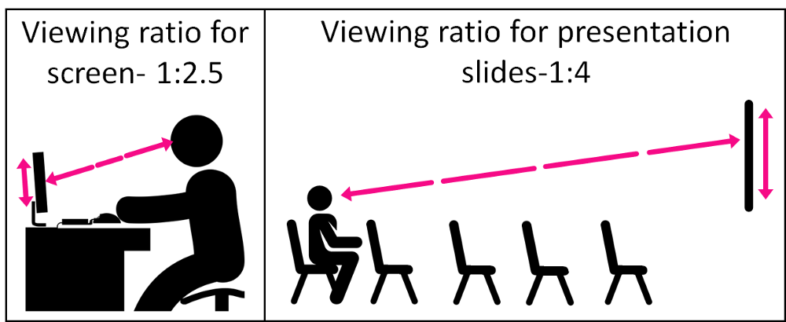
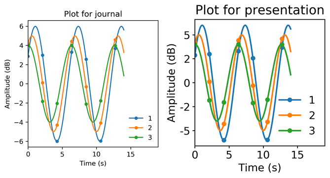

# Using style sheets to tailor figures to different mediums
Tailor your figures for papers/posters/presentations using matplotlib style sheets. 

_Ratio of distance to screen size differs between presentations and papers/web articles. Artwork from svgrepo.com and clipartmax.com_

## To use:
1. Find out matplotlib's configuration directory by typing `matplotlib.get_configdir()`.
1. Go to that directory and create a directory within it called "stylelib"
1. Create new style sheets within stylelib directory for each plotting medium with the extension `.mplstyle"`(e.g. `presentation.mplstyle`). Example style sheets are included in `/stylelib`
1. You're all set! From now on you can simply use the required style based on the intended purpose of your figures.

Comparison of the same figure using `plt.style.use('journal')` and `plt.style.use('presentation')` is given below.

